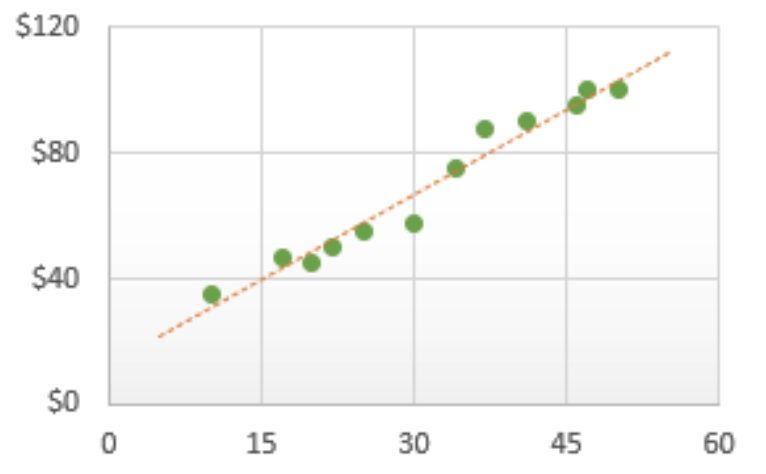

# Giới thiệu về bài toán Linear Regression
Ta có một loạt các cặp dữ liệu thể hiện mối quan hệ giữa **diện tích nhà** và **giá nhà** ở một thành phố như sau. Nếu như mình hỏi bạn nếu như có một căn nhà với diện tích nào đó mà không có trong bản dữ liệu thì bạn có thể **đoán** được giá của căn nhà đó không? Hơi khó đúng không?

Nhưng nếu như ta mô tả đám dữ liệu đó dưới dạng các điểm trên một **hệ trục tọa độ** như thế này thì sao?


Không phải ta sẽ dễ dàng có thể dự đoán được nó hay sao? Mọi thứ sẽ trở nên đơn giản hơn nếu như ta biết cách biểu diễn dữ liệu một cách trực quan hơn.

Nhưng đó là với bạn, một cỗ máy sinh học chạy bằng cơm. Còn với máy tính thì sao? Nếu bạn cho nó một bộ giữ liệu như vậy và yêu cầu nó dự đoán giá nhà với diện tích bất kì thì sao? Câu hỏi tưởng dễ nhưng giờ lại bắt đầu đau não rồi đây.

## Nhận xét về bài toán
Quay trở lại với cái đường thẳng này. Ta có các nhận xét như sau:
* Các điểm đã cho nằm khá gần đường thẳng. 
* Vì là 1 đường thẳng lên sẽ có phương trình là $y_i = ax_i + b$.

Giả sử ta có được đường thẳng được gọi tốt nhất thì vì sao nó lại là tốt nhất. Kiểu chúng ta phải có một thứ gì đó có thể đánh giá được một cái gì đó hơn một cái gì đó khác chứ.

Ta gọi $x_i$ là diện tích của căn nhà và $y_i$ là giá tiền của căn nhà đó.

Nếu đường thẳng là tốt thì $\hat{y_i} = f(x_i)$ phải xấp xỉ với $y_i$. 

Và thứ gì đó ở đây giúp ta đánh giá được độ tệ hại của một đường thẳng với một điểm là:

$$
    (\hat{y_i} - y_i)^2
$$

Và với $n$ điểm là:

$$
    \sum_{i = 1}^{n}(\hat{y_i} - y_i)^2
$$

***Ai đó:** Từ từ, cái con mẹ gì đây, tại sao lại là bình phương? Ta có thể dùng giá trị tuyệt đối mà.*

Lý do chúng ta bình phương là nhằm để cho phương trình không âm và giá trị nhỏ nhất của hàm cũng là $0$ giúp ta dễ tính toán. Ngoài ra nó còn giúp tăng độ khuếch đại với các điểm ở càng xa đừng 
thẳng (Mình sẽ có một bài viết để phân tích kĩ hơn về nó).

Giờ tay hãy phân tích công thức trên một tí.

$$
    L(a, b) = \sum_{i = 1}^{n}(\hat{y_i} - y_i)^2 \\
    L(a, b) = \sum_{i = 1}^{n}(f(x_i) - y_i)^2 \\
    L(a, b) = \sum_{i = 1}^{n}(ax_i + b - y_i)^2 \\
$$

Nếu như ta có một hàm $f$ có thể dự đoán chính xác với $n$ điểm đã cho thì hàm $L$ của ta sẽ đạt giá trị nhỏ nhất. Vậy bài toán lúc này sẽ đưa về việc tìm cặp $(a, b)$ sao cho hàm $L$ đạt giá trị nhỏ nhất.

# Tìm giá trị nhỏ nhất của hàm $L$
Có rất nhiều cách khác nhau để tìm ra cặp $(a,b)$, ở đây mình sẽ liệt kê một bài cách "thú vị". À, trước khi đọc tiếp thì mình sẽ thay đổi một chút về phần ký hiệu để tiện hơn cho sau này.

$$
    w_1 = a \\
    w_2 = b
$$

## Bằng đại số tuyến tính
Như cái tên, thì muốn hiểu phần này bạn phải biết một chút kiến thứ về **đại số tuyến tính**. Mình cũng sẽ viết một bài để giới thiệu về các đại số tuyến tính cơ bản để dùng trong Machine Learning.

Ta có thể biểu diễn cách tham số và biến ở phần trên lại dưới dạng ma trận như sau:

$$
    W = \begin{bmatrix}
    w_1 \\ w_2
    \end{bmatrix} 
$$

$$
    X_i = \begin{bmatrix}
    x_1 & 1
    \end{bmatrix}
$$

$$
    X = \begin{bmatrix}
    x_1 & 1 \\
    x_2 & 1 \\
    x_3 & 1 \\
    ... & .. \\
    x_n & 1
    \end{bmatrix}
$$


$$
    Y = \begin{bmatrix}
    y_1 \\ y_2 \\ y_3 \\ ... \\ y_n
    \end{bmatrix}
$$

Tiếp theo ta sẽ biểu diễn hàm hàm $f$ và hàm $L$ dưới dạng ma trận:

$$
    \hat{Y} = f(X) = XW \\
    \begin{align}
        L(W) = ||Y - \hat{Y} ||_2^2 \\
        L(W) = ||Y - XW ||_2^2 \\
    \end{align}
$$

Với $\|\|z\|\|_2$ là **Euclidean norm** hay **khoảng cách Euclid** của $z$ hay cho dễ hiểu hơn là tổng bình phương của các phần tử trong $z$.

Giờ mới là ma thuật này.

Như ở cấp 3 có học thì **cực trị** của một hàm số sẽ nằm ở những điểm có **đạo hàm** bằng $0$ hoặc không tồn tại đạo hàm tại điểm đó. Ở đây phương trình là **phương trình bậc 2** nên sẽ luôn có tồn tại đạo hàm, không như việc sử dụng **giá trị tuyệt đối**. Thì ta có công thức đạo hàm của hàm $L$ theo biến $W$.

$$
    \frac{\partial{L(W)}}{\partial{W}}
    = X^T(XW - Y)
$$

Bạn có thể đọc qua [tài liệu này](https://ccrma.stanford.edu/~dattorro/matrixcalc.pdf) để tìm hiểu thêm và **đạo hàm của ma trận**.

Quay trở lại bài toán, thì nếu như đạo hàm bằng $0$ tức là:

$$
    \frac{\partial{L(W)}}{\partial{W}} = 0\\
    \longrightarrow X^T(XW - Y) = 0 \\
    \longrightarrow X^T X W = X^T Y ~~~ (1)
$$

Trong trường hợp ma trận $X^T X$ là ma trận **khả nghịch** thì sẽ tồn tại duy nhất một nghiệm $W$.

$$
W = (X^T X)^{-1} (X^T Y)
$$

Còn trong trường hợp ma trận $X^T X$ có **định thức** bằng $0$ hay **không khả nghịch** thì ta có thể dùng ma trận **giả khả nghịch** của nó ký hiệu là $(X^T X)^{\dagger}$. Bạn có thể tự tìm tài liệu để đọc về nó, tại mình cũng không hiểu rõ về nó lắm. Nếu có thời gian thì mình sẽ tìm hiểu và viết một bài viết sau.

Tóm lại thì công thức tổng quát của $W$ sẽ là: 

$$
W = (X^T X)^{\dagger} (X^T Y)
$$

``` python
import numpy as np

x1_list = np.random.rand(500, 1) # tạo mảng x gồm các số ngẫu nhiên

y_list = 4 + 10 * x1_list + 0.2 * np.random.randn(x1_list.shape[0], 1)
#với w_1 = 10 và w_2 = 4, tạo ra các giá trị y tương ứng nhưng bị lệch đi một tí

ones = np.ones((x1_list.shape[0], 1))
X = np.concatenate((ones, x1_list), axis = 1)
# tạo ma trân X

W = np.dot(np.linalg.pinv(np.dot(X.T, X)), np.dot(X.T, y_list))
# Ma thuật của đại số tuyến tính
print(W)

```